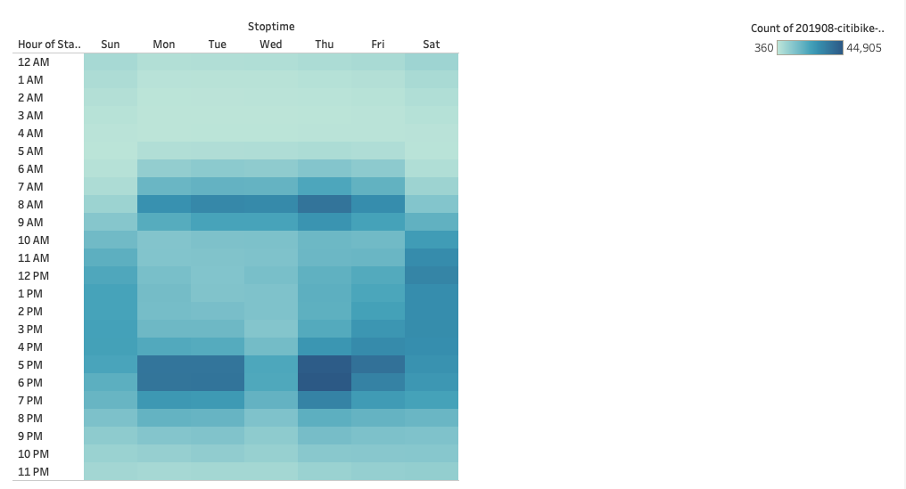
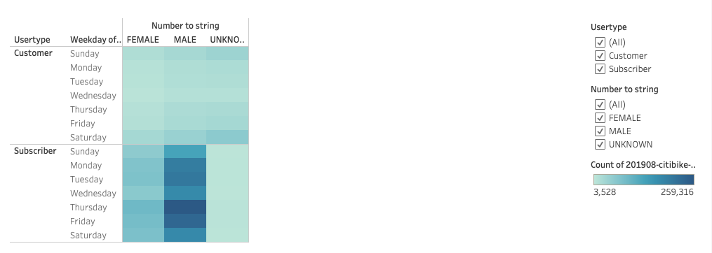

# Citibike Analysis

## Overview 

Created visualization for NYC's Citibike data for potential investor of a similar project in Des Moines, IA. 

### Results

##### Usage Hours

As shown in the image above, there is an uptick in usage of Citibikes during the commute hours on weekdays. On the weekends however, most trips occur during brunch and lunch hours. This indicates that most users aren't tourist as one would normally assume. The following image confirms that deduction. 

##### Weekdays

This heatmap shows how there are more subscribers than customers. This translates to Citibike being a commuter favorite and not a tourist favorite. 

## Summary

One of the main things to factor in while making decisions on future investments would that the potential city for this kind of investment does not need to be a tourist hub. It is clear from the visualizations provided above that most users are subscribers and that they use it during commute hours, meaning that Citibikes are an easy way of work commute for a lot of locals in NYC and surrrounding areas. There is a chance that most of the users categorized as Customers are locals too they just use the bikes on adhoc bases. We should do two additional visualizations to get details of start and end stations for Customer user type only. Those two visualizations will help us see where in the city the Customer user types take their bikes the most. Heatmap showing difference between stations in tourist hotspot vicinities and corporate offices vicinities can provide better and much needed insight on this theory. 

Please see link below for more visualizations on Tableau Story

##### Link 

[link_to_dashboard](https://public.tableau.com/app/profile/waheed.haidaryar/viz/CitibikeVisualizationsFinal/CitiBikePresentation?publish=yes)

